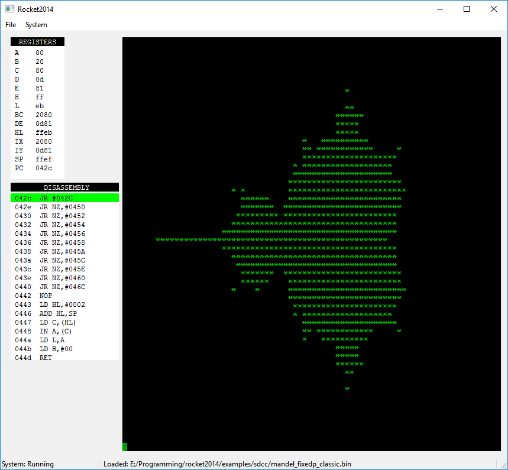

# Rocket2014
## A cross-platform simulator for the RC2014 Z80-based computer

The simulator has a classic green console/display, shows the Z80 registers and disassembly in real time, while a program is running.

The terminal supports colour codes based on the XTerm colour palette and escape sequences.

It is written in C++/Qt5.5

