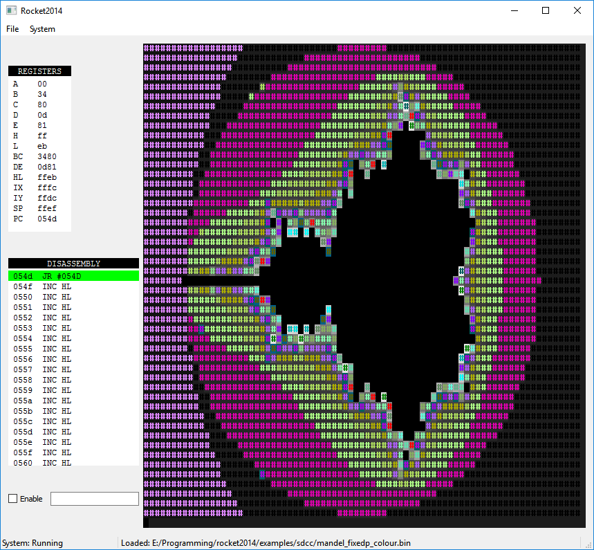

# Rocket2014
## A cross-platform simulator for the RC2014 Z80-based computer

The simulator has a classic green console/display, shows the Z80 registers and disassembly in real time, while a program is running.

The terminal supports colour codes based on the XTerm colour palette and escape sequences.

It is written in C++/Qt5.5

## Build instructions

* Install QtCreator with Qt version 5.5 or higher.
* Start QtCreator and load the rocket2014.pro project file from the 'src' directory.
* QtCreator will as you to configure the project; clicking 'configure' will usually suffice here.
* Select the type of build you want (Release or Debug) using the control/box just above the green 'play' icon (bottom left-hand side of the window).
* Click 'Run' or 'Build all' from the 'Build' menu.

Note: you need a C++11 capable compiler installed. For windows this means Visual Studio 2013 or better. Mingw/gcc will probably also work, but I have no experience with recent versions of this compiler under windows.

## Binary distribution

At this time, there is no binary distribution of this project. As soon as I figure out how to package the whole thing, I'll provide an installer for windows.

## Reporting compile issues/bug

Please send bug reports to: sofascener (email atsign here) gmail.com.
